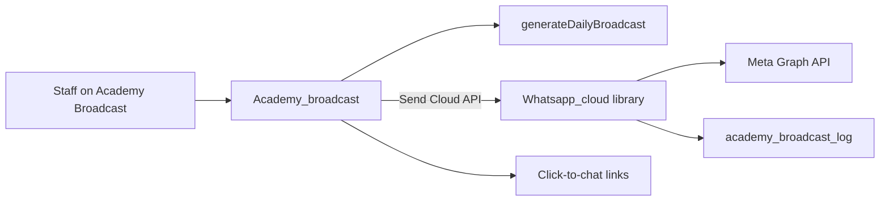

# WhatsApp Business Cloud API for Academy Broadcast

## Current state

- [broadcast.php](application/views/academy/broadcast.php) only opens `api.whatsapp.com/send` links (manual).
- [Academy_model::generateDailyBroadcast()](application/models/Academy_model.php) already builds per-parent `message`, `parent_contact`, and `media[]`.
- [Academy_broadcast](application/controllers/Academy_broadcast.php) only previews / logs — no API send.
- Existing Twilio stack is SMS-only; do **not** reuse it for Meta Cloud API.
- Site WhatsApp chat widget (`whatsapp_chat` / `whatsapp_agent`) is unrelated click-to-chat chrome.

## Defaults (locked for this plan)

1. **Outbound mode:** Meta **utility template** for cold/bulk send (required outside the 24h window), plus **session text** when config allows and a recent conversation exists. Primary staff action = “Send via Cloud API” using a configured template name + body variables derived from the digest (student name, date, short summary, first media URL if any).
2. **Config:** File config like Tarteel — [application/config/whatsapp.php](application/config/whatsapp.php) with placeholders (`access_token`, `phone_number_id`, `waba_id`, `api_version`, `template_name`, `template_lang`, `enabled`). No secrets committed with real values; gitignore note in config header. School Settings UI is a later pass.
3. **Media:** Keep **HTTPS URLs inside the message/template vars** (same as today). No Meta media upload in v1 (Hostinger public URLs already required).
4. **Webhook:** Out of scope for v1 (no delivery status webhook yet). Log Meta `wamid` / error from the send response only.
5. **Click-to-chat:** Keep as fallback when API disabled or send fails.

## Implementation

### 1. Config
Add [application/config/whatsapp.php](application/config/whatsapp.php):
- `enabled`, `access_token`, `phone_number_id`, `api_version` (e.g. `v21.0`)
- `template_name`, `template_lang` (e.g. `en`)
- `template_body_params` mapping documented in comments (student, date, summary, media_url)
- Optional `graph_base` default `https://graph.facebook.com`

### 2. Library
Add [application/libraries/Whatsapp_cloud.php](application/libraries/Whatsapp_cloud.php):
- `isConfigured()` / `isEnabled()`
- `normalizeNgPhone($raw)` — shared NG `0…` → `234…` E.164 digits (lift from broadcast view)
- `sendTemplate($toE164, $params)` → `POST /{phone_number_id}/messages` with `type: template`
- `sendText($toE164, $body)` → session free-form (used only when explicitly requested / short path; default bulk path uses template)
- cURL + Bearer token; return `{ ok, wamid, error }`
- Never log the access token

### 3. Model helpers
In [Academy_model.php](application/models/Academy_model.php):
- `normalizeParentPhone($raw)` (or call library)
- `digestTemplateParams($report)` — map digest → short template vars (stay within Meta length limits; truncate summary)
- Extend `logBroadcastPreview()` / add `logBroadcastSend()` to store `channel=whatsapp_cloud`, `status=sent|failed`, `parent_contact`, optional `meta_message_id`, `error_message`
- Small migration [application/migrations/whatsapp_broadcast_log.sql](application/migrations/whatsapp_broadcast_log.sql) altering `academy_broadcast_log` if columns missing (`meta_message_id`, `error_message`, widen `status`/`channel`)

### 4. Controller
Update [Academy_broadcast.php](application/controllers/Academy_broadcast.php):
- POST `send_cloud_api` — loop reports with phone; call library; collect success/fail counts; `set_alert` summary; log each
- Skip rows without phone; rate-limit lightly (small `usleep` between sends) to avoid burst errors
- Guard: refuse if `whatsapp.enabled` false or missing credentials
- Permission: same staff gate as preview (tighten to `academy_broadcast` permission if already in DB from v2)

### 5. UI
Update [broadcast.php](application/views/academy/broadcast.php):
- Replace “Cloud API later” note with status: **Ready / Not configured**
- Button **Send digests via WhatsApp API** (confirm via existing SweetAlert/`academy-confirm` pattern if present; else form POST confirm)
- Per-row optional “Send this parent” secondary action
- Keep Open chat / Share group / Copy actions

### 6. Docs (light)
One short subsection under Academy in [doc.html](doc.html) describing Cloud API send + config file + template requirement. No tokens in docs.

## Meta setup you will do outside code
- Create/approve a WhatsApp **utility template** in Meta Business Manager whose body variables match the mapping in `whatsapp.php`
- Put token + phone number ID into local `whatsapp.php` (or server copy outside git)
- Ensure media URLs are public HTTPS (production Hostinger), not localhost

## Out of scope (v1)
- Incoming message webhook / two-way chat
- Twilio WhatsApp
- School Settings credential UI
- Uploading audio as native WhatsApp media attachments
- Automated cron send
